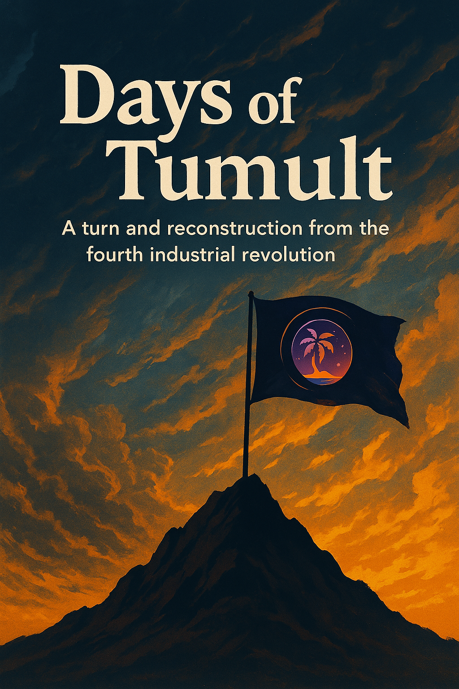

Hello, and welcome to the first island of Star DAO.

I don’t know if anyone will really read this. I don’t know if anyone will believe in this system. Maybe no one will care, and maybe it will never go anywhere.

But I’ve spent a long time thinking, planning, and rewriting this. Not because I wanted to create something grand, but because I wanted to do something real. Something that gives order without control, and possibility without chaos.

This is not a revolution. It’s not a promise of freedom or wealth. It’s just a small framework, a structure that I believe can help people work together, build things together, and avoid the usual problems of power, greed, and confusion.

Maybe it will fail. Maybe it will be ignored. But it will be **clean**, it will be **transparent**, and it will be **mine**. And if someone else sees it, and wants to build something of their own on top of it, then that’s enough for me.

This is my declaration of an island. Not perfect, not powerful, but clear in its direction.

If you're reading this: welcome.

– Founder of the First Island

# 🔗 Connection to the Core Mechanism of STARDAO
This project is fully based on the governance and capital flow mechanisms defined by STARDAO.  
Please refer to the following foundational documents for a deeper understanding:

- [🌌 STARDAO Whitepaper](https://github.com/STARDAOLEADER-OH/STARDAO/blob/main/STARDAO-Whitepaper.md)  
- [🧭 Core Mechanism of STARDAO](https://github.com/STARDAOLEADER-OH/STARDAO/blob/main/CORE_MECHANISM.md)
All fund distribution, incentive decay, project autonomy, and anti-corruption rules of this sub-project strictly comply with the STARDAO framework.
These documents explain the logic behind incentive design, governance structure, and how value is distributed among creators, developers, and contributors within the ecosystem.

👉 View all subprojects: [PROJECTS.md](./PROJECTS.md)
