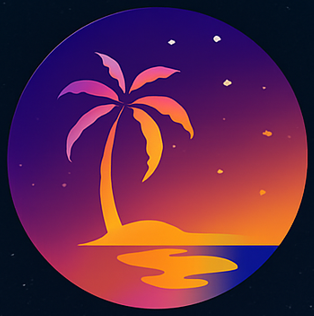

 

✅ **[Final STAR DAO Whitepaper – Conflict-Resolved Full English Version]**

---

### **System Rule: Immutable Transparency Protocol**

> Under the STAR DAO ecosystem, all participants, all projects, all proposals, rules, and decisions shall be permanently recorded on-chain as verifiable signal values. These records form the immutable memory of the ecosystem, and shall remain open to public access at all times.

#### **View & Verification Policy**:
- Gas fees must be paid by the requester, as required by the underlying blockchain network.
- A query access fee (in XCB) may also be charged by the smart contract to support infrastructure maintenance and ensure responsible usage.

#### **Data Redundancy**:
All core smart contracts, governance rules, funding distribution mechanisms, and their corresponding execution records shall be stored in multiple secure cloud servers, with at least three independent cloud service providers for redundancy and availability.

---

## **STAR DAO Ecosystem Governance and Fund Distribution Framework**

### **1. Overview**
STAR DAO is a decentralized open ecosystem guided by a central governance node referred to as the Main Island. It acts as the architectural and value core that enables the creation, coordination, and supervision of sub-projects ("Sub-Islands" or "Zhizhi") that follow the core economic and governance principles of the STAR DAO protocol.

---

### **2. Project Structure and Roles**
Projects are initially incubated directly under the Main Island, guided and monitored by the DAO leader. These incubated projects are referred to as "Hatchling Projects." Upon obtaining external capital injection or reaching significant operational scale, a project becomes a Sub-Island and elects its own Sub-Island Leader.

> **Note**: The Main Island DAO leader cannot simultaneously serve as a Sub-Island Leader to avoid role conflicts.

---

### **3. Fund Distribution in Sub-Islands**
Each Sub-Island follows a mandatory fund distribution model:
- 40% to the Capital Group (investors)
- 40% to internal Committees (Governance, Module, Platform, etc.)
- 10% to the Platform Development Fund (PDF) within the project
- 5% to the Sub-Island Leader
- 5% submitted to the Main Island

---

### **4. Redistribution within the Main Island**
From the 5% submitted by each Sub-Island:
- 1% to the Main Island DAO leader
- 4% split between the Asset Development Fund (ADF) and Charity Fund (CF), with dynamic proportioning between 0.5% and 3.5% each, adjustable by the DAO leader.

---

### **5. Governance Philosophy**
- No stakeholder (capital, knowledge, or platform) may hold perpetual entitlement.
- All distributions are governed by smart contracts to prevent manipulation.
- Projects may design their internal governance, but must use official STAR DAO smart contract templates approved by the Main Island.

---

### **6. Exit Clause and Enforcement**
Divergence from the STAR DAO core financial protocol constitutes a detachment:
- 50% of the Sub-Island’s smart contract funds are transferred to the Main Island’s ADF.
- The Main Island may replicate the project and restart a competing version.
- Personnel/capital may rejoin the new version under the Main Island.

---

### **7. Anti-Monopoly Mechanism**
- Committee and capital rights degrade over time.
- Decayed shares are redirected to the ADF to support new public-benefit projects.

---

### **8. Charity and Crisis Mechanism**
- CF is for cross-project social initiatives.
- ADF serves as emergency reserve.
- Inter-project fund borrowing must be approved by both source committees and the Main Island.

---

### **9. Smart Contract Oversight**
- Required post-capital involvement.
- Must be reviewed and approved by the Main Island.
- Capital investors retain full transparency into fund flows.

---

### **10. DAO Leader Rotation and Oversight**
- Elected every 50 weeks by Sub-Island representatives.
- Holds veto power only; no executive/appointment rights.
- May be removed through joint opposition by capital/committee representatives or 4/5 assembly vote.

---

### **11. Degradation Mechanism of Revenue Rights**
To prevent wealth/power concentration:
- Intellectual Committee Points degrade weekly. Higher amounts degrade faster.
- Module rewards degrade with time/inactivity.
- Capital shares degrade 0.1% per week (full degradation in ~20 years).

> Minimum degradation duration: 10 years. Maximum: 20 years.

---

### **12. Use and Ownership of Technology**
- Technologies developed pre-exit: 50/50 co-owned.
- Technologies post-exit: fully owned by the departing project.

---

### **13. Oversight Committee (OC) – Structure & Activation**
- Three groups (1:1:1 ratio): Platform, Capital, External Public.
- 50-week term; max 3 consecutive terms; **1/3 renewal required each term** (most important condition).
- OC activated when 50-week average weekly revenue to Main Island >= $500,000.
- OC must be independent (no project/governance/funding roles).

---

### **14. Oversight Committee Powers & Operation**
- Audit DAO leader, projects, and smart contracts.
- Launch emergency actions.
- Submit DAO leader recall motions.
- Funded by 0.5% of total project profit (10% of the 5% Main Island allocation).

---

### **15. Oversight Reporting & Transparency**
- Minor, Intermediate, and Major cases classified accordingly:
  - **Minor**: staff-level misconduct, handled by OC
  - **Intermediate**: committee/investor/representative-level, notified to DAO leader
  - **Major**: full project failure or multi-project conflict, escalated to Global Assembly with 4/5 vote
- OC decisions recorded on-chain.
- Annual reports submitted by each DAO leader and the OC to Global Assembly.

---

### **16. Data Integrity & Upload Duties**
- DAO leader must ensure all governance data uploaded within 14 days.
- Backups stored in 3 cloud providers, verified with on-chain hash.
- On-chain data holds final legal precedence.

---

### **17. Appeals & Dispute Resolution**
- Appeals to be submitted to DAO leader’s office.
- Only escalated to Global Assembly with substantial new evidence.
- DAO leader may not override OC judgments but may escalate for full review.

---

### **18. Anti-Corruption & Continuity**
- No lifetime entitlements.
- OC and DAO leader both bound by term limits.
- All funds and actions trackable and verifiable on-chain.

---

### **19. Founder Clause**
- Upon retirement, Founder may retain 10% of DAO leader’s dividend.
- This legacy share is non-transferable and expires upon death.
- Founder becomes an Honorary Advisor with speaking rights only.

---

### **20. Taxation & Jurisdiction**
- Projects forming legal entities must follow local tax laws.
- XCB-to-fiat conversions may be taxable.
- DAO encourages transparency but does not enforce tax compliance.

---

> This version reflects all final conflict resolutions, unified terminology, and structural clarifications. Main Island = unified term for all prior variants; DAO leader = sole term for top governance role.
